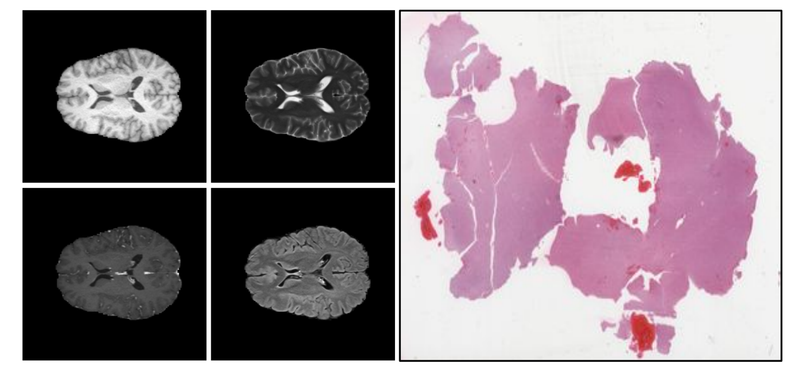

# RadPath

Example images of the RadPath dataset. The image shows the inferior radiology-based multisequence MRI on the left and superior histopathology WSI on the right.



RadPath is a publicly available dataset of multimodal brain tumor images from the [RadPath 2020](https://miccai.westus2.cloudapp.azure.com/competitions/1) challenge and can be downloaded from [here](http://miccai2020-data.eastus.cloudapp.azure.com/).

---

## Radiology

### Requirements

Use the `env_rad.yml` conda environment for training the modality-specific classifier for radiology as follows:

```
cd radpath
conda env create -f env_rad.yml
conda activate env_rad
```

### Models

1) Train the baseline classifier of radiology as follows:

`python train.py -b 10 -e 600 -m t1 -f 1 --early_stopping --dropout 0.1 -x exp_t1`

2) To extract the latent representations, use the `latent_represenetations.ipynb` notebook
